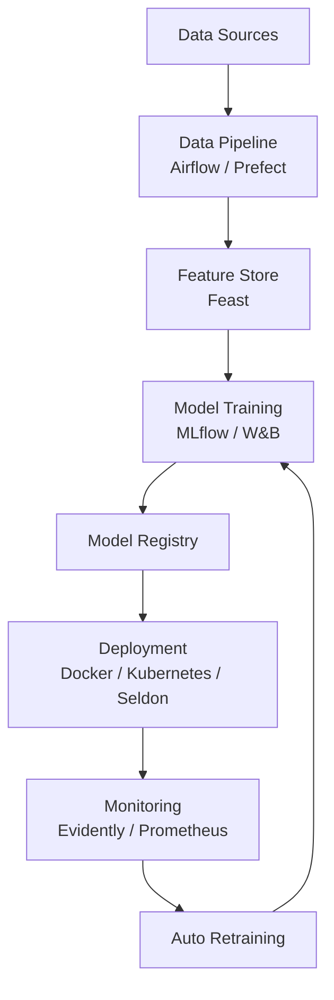

# 📘 **MLOps — Complete Guide**

*A comprehensive overview of MLOps, lifecycle, tools, and architecture.*

---

<p align="center">


</p>

---

# 📌 **Table of Contents**

1. [What is MLOps?](#what-is-mlops)
2. [Why MLOps?](#why-mlops)
3. [Who Needs MLOps?](#who-needs-mlops)
4. [Traditional Data Science Lifecycle](#traditional-data-science-lifecycle)
5. [Where MLOps Fits](#where-mlops-fits)
6. [End-to-End MLOps Lifecycle](#end-to-end-mlops-lifecycle)
7. [Architecture Diagrams](#architecture-diagrams)
8. [Tools in MLOps](#tools-in-mlops)
9. [Conclusion](#conclusion)

---

# 🧠 **What is MLOps?**

**MLOps (Machine Learning Operations)** is a methodology and toolset that helps teams:

* Build
* Deploy
* Monitor
* Maintain

machine learning models **in production** reliably and at scale.

It is the intersection of:

```
ML (Machine Learning) + DevOps + Data Engineering
```

---

# 🔍 **Why MLOps?**

MLOps solves real-world problems such as:

* ❌ Manual deployments
* ❌ Lack of monitoring (data drift, model decay)
* ❌ Reproducibility issues
* ❌ Slow iteration cycles
* ❌ No automation for retraining

With MLOps:

* ✔ CI/CD/CT pipelines
* ✔ Automated data pipelines
* ✔ Model registry
* ✔ Continuous monitoring
* ✔ Scalable deployment

---

# 👥 **Who Needs MLOps?**

MLOps is needed by organizations that:

| Industry        | Use Case                       |
| --------------- | ------------------------------ |
| **Finance**     | Fraud detection, risk modeling |
| **E-commerce**  | Recommendation engines         |
| **Healthcare**  | Medical diagnosis, predictions |
| **Logistics**   | Supply chain automation        |
| **AI Startups** | Model deployment & iteration   |

Basically: **anywhere ML goes to production**, MLOps is required.

---

# 📈 **Traditional Data Science Lifecycle**

```
Business Understanding
        ↓
Data Collection
        ↓
Data Cleaning & Processing
        ↓
Exploratory Data Analysis (EDA)
        ↓
Model Training
        ↓
Evaluation
        ↓
(Usually fails here)
Deployment
```

Without MLOps, teams struggle after deployment due to:

* No versioning
* No pipelines
* No monitoring
* No reproducibility

---

# 🔗 **Where MLOps Fits**

MLOps enhances the **entire lifecycle**:

| Stage      | Before MLOps    | With MLOps                             |
| ---------- | --------------- | -------------------------------------- |
| Data       | Manual scripts  | Automated versioned pipelines          |
| Training   | Local notebooks | Reproducible automated training        |
| Deployment | Hard            | CI/CD, one-click deployment            |
| Monitoring | Hardly done     | Automated drift & performance tracking |
| Retraining | Manual          | Continuous Training (CT)               |

---

# 🔄 **End-to-End MLOps Lifecycle**

1. **Data Versioning** → Git, DVC
2. **Experiment Tracking** → MLflow, W&B
3. **Model Registry** → MLflow, SageMaker
4. **Model Packaging** → Docker
5. **CI/CD/CT Pipelines** → GitHub Actions, Jenkins
6. **Deployment** → Kubernetes, Seldon, FastAPI
7. **Monitoring** → EvidentlyAI, Prometheus
8. **Automated Retraining**

---

# 🖼 **Architecture Diagrams**

---

## ✅ **High-Level MLOps Architecture (ASCII Diagram)**

```
                ┌──────────────────────────┐
                │      Data Sources         │
                └──────────────┬───────────┘
                               │
                        ┌──────▼───────┐
                        │ Data Pipeline │ (Airflow / Prefect)
                        └──────┬───────┘
                               │
                ┌──────────────▼──────────────┐
                │   Feature Store (Feast)      │
                └──────────────┬──────────────┘
                               │
                       ┌───────▼────────┐
                       │ Model Training  │ (MLflow / W&B)
                       └───────┬────────┘
                               │
                     ┌─────────▼─────────┐
                     │  Model Registry    │
                     └─────────┬─────────┘
                               │
                       ┌───────▼────────┐
                       │   Deployment    │ (Docker/K8s/Seldon)
                       └───────┬────────┘
                               │
                   ┌───────────▼────────────┐
                   │ Monitoring & Alerting   │ (Evidently/Prometheus)
                   └───────────┬────────────┘
                               │
                       ┌───────▼──────────┐
                       │ Auto Retraining   │
                       └───────────────────┘
```

---

## ✅ **Mermaid Diagram (GitHub renders this automatically)**



---

# 🛠 **Tools in MLOps**

Below are the essential tools by category:

---

## 📌 **1. Version Control**

| Tool            | Purpose                 |
| --------------- | ----------------------- |
| GitHub / GitLab | Code versioning         |
| DVC             | Data & model versioning |

---

## 📌 **2. Experiment Tracking**

| Tool             | Purpose                        |
| ---------------- | ------------------------------ |
| MLflow           | Track runs, metrics, artifacts |
| Weights & Biases | Dashboards, model insights     |
| Neptune.ai       | Experiment management          |

---

## 📌 **3. Orchestration**

| Tool     | Purpose                    |
| -------- | -------------------------- |
| Airflow  | Pipeline scheduling        |
| Prefect  | Modern automated pipelines |
| Kubeflow | ML-specific orchestration  |

---

## 📌 **4. Deployment Tools**

| Tool        | Purpose               |
| ----------- | --------------------- |
| Docker      | Containerization      |
| Kubernetes  | Scaling ML services   |
| Seldon Core | ML deployment on K8s  |
| FastAPI     | API endpoint creation |

---

## 📌 **5. Monitoring**

| Tool        | Purpose            |
| ----------- | ------------------ |
| EvidentlyAI | Data & model drift |
| Prometheus  | Metrics collection |
| Grafana     | Dashboards         |

---

## 📌 **6. Cloud Platforms**

| Platform      | Why Use It             |
| ------------- | ---------------------- |
| AWS Sagemaker | End-to-end MLOps       |
| GCP Vertex AI | Unified ML lifecycle   |
| Azure ML      | Enterprise ML platform |

---

# 🏁 **Conclusion**

MLOps is the backbone of **production machine learning** and solves the challenges of scaling experiments into reliable systems.

With:

* versioning,
* orchestration,
* automation,
* CI/CD/CT,
* monitoring,
* and cloud native tools,

teams can deploy ML systems **faster, safer, and more reliably**.

